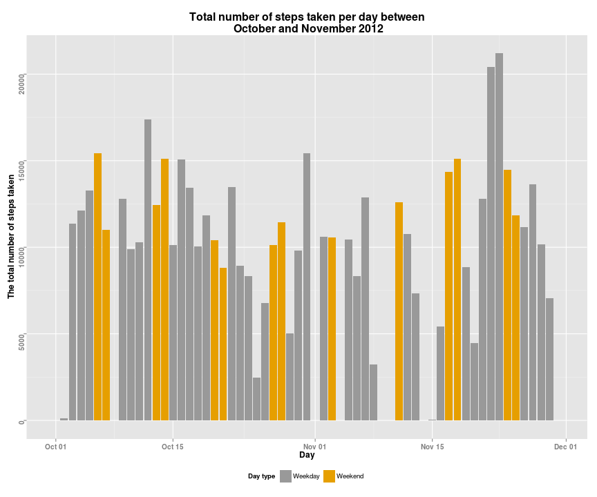
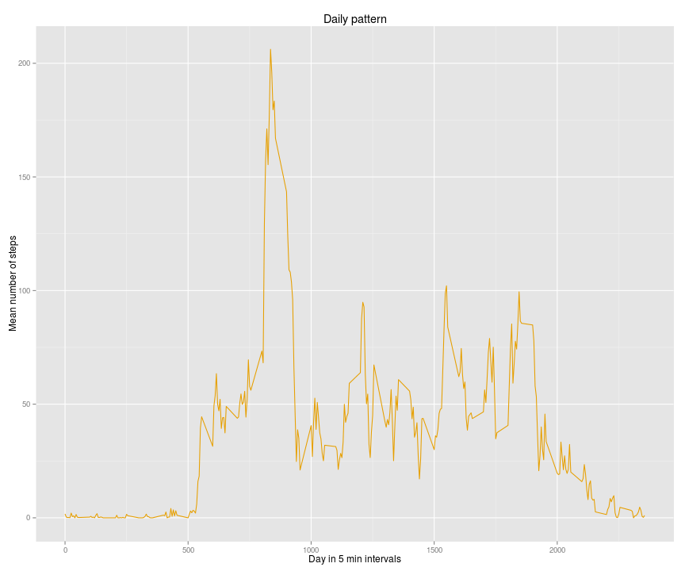
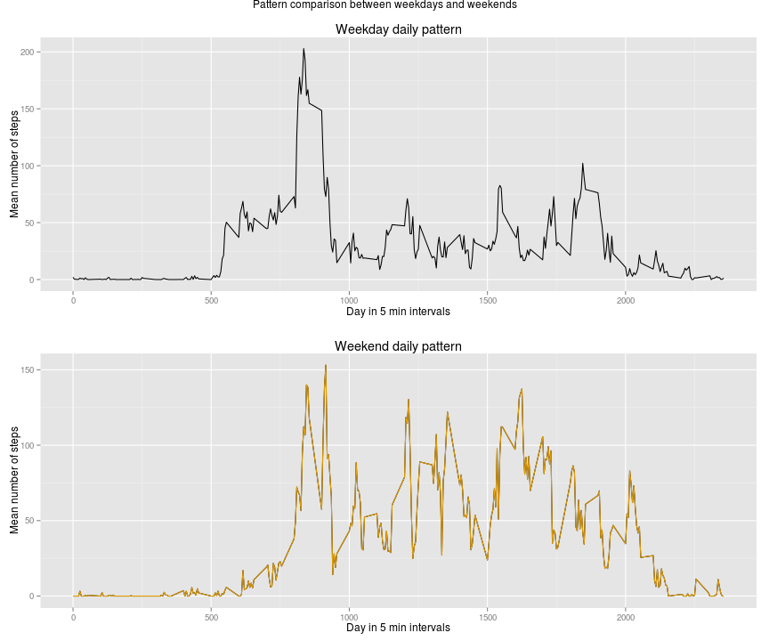

# Reproducible Research: Peer Assessment 1

This is Peer Assessment 1 for [Reproducible Research project](https://www.coursera.org/course/repdata). The assingment description is found in detail at [README.md](./README.md)


## Loading and preprocessing the data


```r
library(knitr)
library(ggplot2)
library(chron)
library(plyr)
library(grid)
library(gridExtra)


activityDF<-read.table('./data//activity.csv',header=TRUE,sep=",")

activityDF$date<-as.Date(activityDF$date,"%Y-%m-%d")

str(activityDF)
```

```
## 'data.frame':	17568 obs. of  3 variables:
##  $ steps   : int  NA NA NA NA NA NA NA NA NA NA ...
##  $ date    : Date, format: "2012-10-01" "2012-10-01" ...
##  $ interval: int  0 5 10 15 20 25 30 35 40 45 ...
```

```r
summary(activityDF)
```

```
##      steps            date               interval   
##  Min.   :  0.0   Min.   :2012-10-01   Min.   :   0  
##  1st Qu.:  0.0   1st Qu.:2012-10-16   1st Qu.: 589  
##  Median :  0.0   Median :2012-10-31   Median :1178  
##  Mean   : 37.4   Mean   :2012-10-31   Mean   :1178  
##  3rd Qu.: 12.0   3rd Qu.:2012-11-15   3rd Qu.:1766  
##  Max.   :806.0   Max.   :2012-11-30   Max.   :2355  
##  NA's   :2304
```

### Setting some options

- Setting locale to different from system time locale
- Setting output directory for generated figures

```r
Sys.setlocale(category = "LC_TIME", locale = "en_US.UTF-8")
```

```
## [1] "en_US.UTF-8"
```

```r
if(!file.exists('./figures')){dir.create('./figures')}
opts_chunk$set(fig.path='./figures/')
```


## What is mean total number of steps taken per day?


```r
stepsByDay<-as.data.frame(tapply(activityDF$steps,activityDF$date,sum,na.rm = TRUE))
stepsByDay<-cbind(day=as.Date(rownames(stepsByDay),"%Y-%m-%d"),stepsByDay)
stepsByDay$weekend<-unlist(lapply(stepsByDay$day,is.weekend))
stepsByDay$weekend<-as.factor(stepsByDay$weekend)
levels(stepsByDay$weekend)[levels(stepsByDay$weekend)==TRUE]<-"Weekend"
levels(stepsByDay$weekend)[levels(stepsByDay$weekend)==FALSE]<-"Weekday"
names(stepsByDay)<-c("day","steps","weekend")
str(stepsByDay)
```

```
## 'data.frame':	61 obs. of  3 variables:
##  $ day    : Date, format: "2012-10-01" "2012-10-02" ...
##  $ steps  : int [1:61(1d)] 0 126 11352 12116 13294 15420 11015 0 12811 9900 ...
##   ..- attr(*, "dimnames")=List of 1
##   .. ..$ : chr  "2012-10-01" "2012-10-02" "2012-10-03" "2012-10-04" ...
##  $ weekend: Factor w/ 2 levels "Weekday","Weekend": 1 1 1 1 1 2 2 1 1 1 ...
```

### Histogram


```r
g<-ggplot(data=stepsByDay, mapping=aes(x = day, y = steps, fill=factor(weekend))) +
        geom_bar(stat = "identity")+
        scale_fill_manual(values = c("#999999", "#E69F00"))+
        theme(legend.position = "bottom", legend.box = "horizontal")+
        labs(y="The total number of steps taken")+
        labs(x="Day")+
        labs(title="Total number of steps taken per day between\n October and November 2012")+
        labs(fill = "Day type")+
        theme(plot.title= element_text(lineheight=.9, face="bold",colour="#000000", size=16),
                axis.title=element_text(face="bold",size=12),
                axis.text.x=element_text(hjust=0.5, size=10,face="bold"),
                axis.text.y=element_text(angle=90, vjust=0.75, size=10,face="bold"))
g
```

 


### The mean and median for total number of steps taken per day


```r
# sum steps by date variable
stepsEachDay<-ddply(activityDF, .(date), summarize,sum(steps))
names(stepsEachDay)<-c("date","steps")
dayMeanSteps<-mean(stepsEachDay$steps,na.rm=TRUE)
dayMedianSteps<-median(stepsEachDay$steps,na.rm=TRUE)

## setting to integer for display reasons
dayMeanSteps<-as.integer(round(dayMeanSteps))
```

The daily mean number of steps is 10766 and
the daily median number of steps is 10765.


## What is the average daily activity pattern?

- NA's removed
- Then average is calculated for each 5 intervals
- Time series plot is done for intervals and 5 min averages

```r
activityNoNasDF<-activityDF[!is.na(activityDF$steps),]
meanStepsByInterval<-ddply(activityNoNasDF,.(interval),summarize,mean(steps))
names(meanStepsByInterval)<-c("interval","meanSteps")

maxSteps<-max(meanStepsByInterval$meanSteps)
maxStepsInterval<-meanStepsByInterval[meanStepsByInterval$meanSteps==maxSteps,][,"interval"]
```


```r
p<-ggplot(data=meanStepsByInterval, mapping=aes(x = interval, y = meanSteps))+
        geom_line(aes(group=1), colour="#E69F00")+
        labs(x="Day in 5 min intervals")+
        labs(y="Mean number of steps")+
        labs(title="Daily pattern")
p
```

 

Across the all days 5-min avarages, the maximum number of steps occurs at 835 interval, and the maximum value is 206.1698.

## Imputing missing values


```r
# get NA's for steps variable
nas<-nrow(activityDF[is.na(activityDF$steps),])


zeros<-nrow(activityDF[activityDF$steps==0,])

dailyMedian<-ddply(activityDF, .(date), summarize,median(steps))
names(dailyMedian)<-c("date","medianSteps")
dailyMedian[is.na(dailyMedian)]<-0

## create copy 
paddedActivity<-activityDF

## replace NA's with daily median value

for (s in seq_along(activityDF$steps)){
        if (is.na(activityDF$steps[s])){
            paddedActivity$steps[s]<-dailyMedian$medianSteps[dailyMedian$date==activityDF$date[s]]
        } 
}

stepsByDay2<-as.data.frame(tapply(paddedActivity$steps,paddedActivity$date,sum,na.rm = TRUE))
stepsByDay2<-cbind(day=as.Date(rownames(stepsByDay2),"%Y-%m-%d"),stepsByDay2)
stepsByDay2$weekend<-unlist(lapply(stepsByDay2$day,is.weekend))
stepsByDay2$weekend<-as.factor(stepsByDay2$weekend)
levels(stepsByDay$weekend)[levels(stepsByDay2$weekend)==TRUE]<-"Weekend"
levels(stepsByDay$weekend)[levels(stepsByDay2$weekend)==FALSE]<-"Weekday"
names(stepsByDay2)<-c("day","steps","weekend")
str(stepsByDay2)
```

```
## 'data.frame':	61 obs. of  3 variables:
##  $ day    : Date, format: "2012-10-01" "2012-10-02" ...
##  $ steps  : num [1:61(1d)] 0 126 11352 12116 13294 ...
##   ..- attr(*, "dimnames")=List of 1
##   .. ..$ : chr  "2012-10-01" "2012-10-02" "2012-10-03" "2012-10-04" ...
##  $ weekend: Factor w/ 2 levels "FALSE","TRUE": 1 1 1 1 1 2 2 1 1 1 ...
```


### Histogram with replace NA values

```r
g2<-ggplot(data=stepsByDay2, mapping=aes(x = day, y = steps, fill=factor(weekend))) +
        geom_bar(stat = "identity")+
        scale_fill_manual(values = c("#999999", "#E69F00"))+
        theme(legend.position = "bottom", legend.box = "horizontal")+
        labs(y="The total number of steps taken")+
        labs(x="Day")+
        labs(title="Total number of steps taken per day between\n October and November 2012 \n (Missing values replaced with daily median)")+
        labs(fill = "Day type")+
        theme(plot.title= element_text(lineheight=.9, face="bold",colour="#000000", size=16),
                axis.title=element_text(face="bold",size=12),
                axis.text.x=element_text(hjust=0.5, size=10,face="bold"),
                axis.text.y=element_text(angle=90, vjust=0.75, size=10,face="bold"))
g2
```

 

Histograms have naturally no difference as median (zero for all days) was used for padding NA values.

### The mean and median for total number of steps taken per day with NA values replaced by daily median


```r
# sum steps by date variable
stepsEachDay2<-ddply(paddedActivity, .(date), summarize,sum(steps))
names(stepsEachDay2)<-c("date","steps")
dayMeanSteps2<-mean(stepsEachDay2$steps,na.rm=TRUE)
dayMedianSteps2<-median(stepsEachDay2$steps,na.rm=TRUE)

## setting to integer for display reasons
dayMeanSteps2<-as.integer(round(dayMeanSteps2))
```


1. The total number of missing values for steps variable is 2304.
2. Daily median is used to replace NA values as majority of the step variable values are zeros, in fact 13318 values. For those days where median cannot be computed zero is added. As median is zero for all days, essentional zero is used for filling the missing values.
3. Dataset with padded values is called paddedActivity
4. Reported values:

- The daily mean number of steps is 9354
- The daily median number of steps is 1.0395 &times; 10<sup>4</sup>.
- Difference between daily mean of padded and original is -1412 steps.
- Difference between daily median of padded and original is -370 steps.
- Impact due to padding (in this case zero)  with the daily median value causes both the mean and the median to decrease.

## Are there differences in activity patterns between weekdays and weekends?


```r
## creating new factor to indicate week day type 
paddedActivity$weekend<-unlist(lapply(paddedActivity$date,is.weekend))
paddedActivity$weekend<-as.factor(paddedActivity$weekend)
levels(paddedActivity$weekend)[levels(paddedActivity$weekend)==TRUE]<-"Weekend"
levels(paddedActivity$weekend)[levels(paddedActivity$weekend)==FALSE]<-"Weekday"

weekendActivity<-ddply(paddedActivity[paddedActivity$weekend=="Weekend",],.(interval),summarize,mean(steps))
names(weekendActivity)<-c("interval","meanSteps")

weekActivity<-ddply(paddedActivity[paddedActivity$weekend=="Weekday",],.(interval),summarize,mean(steps))
# merge to one
weekActivity$weekend<-weekendActivity[,"meanSteps"]
names(weekActivity)<-c("interval","weekday","weekend")


pweekday<- ggplot(data=weekActivity, aes(x=interval,y=weekday))+ 
        geom_line()+
        labs(x="Day in 5 min intervals")+
        labs(y="Mean number of steps")+
        labs(title="Weekday daily pattern")
pweekend<-ggplot(weekActivity, aes(interval, weekend))+
        geom_line()+
        geom_line(aes(group=1), colour="#E69F00")+
        labs(x="Day in 5 min intervals")+
        labs(y="Mean number of steps")+
        labs(title="Weekend daily pattern")

grid.arrange(pweekday,pweekend, nrow = 2, main = "Pattern comparison between weekdays and weekends")
```

 

